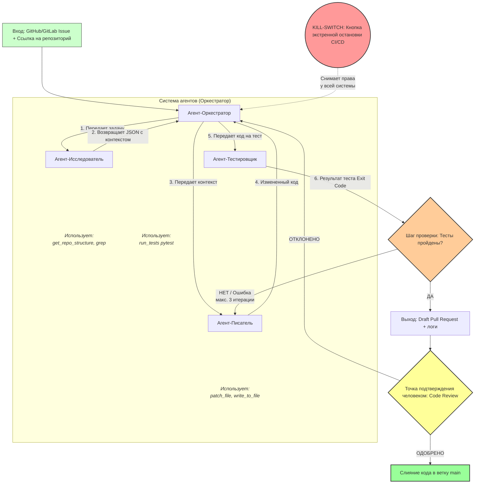

```mermaid
graph TD
    %% Входные данные
    Input[Вход: GitHub/GitLab Issue + Ссылка на репозиторий] --> ORCH

    %% Главный Оркестратор
    subgraph "Система агентов (Оркестратор)"
        ORCH[Агент-Оркестратор]

        %% Агент Исследователь
        ORCH -->|1. Передает задачу| NAV[Агент-Исследователь]
        NAV -->|2. Возвращает JSON с контекстом| ORCH
        NAV ~~~ NAV_TOOLS["Использует:<br>get_repo_structure, grep"]

        %% Агент Писатель
        ORCH -->|3. Передает контекст| CODER[Агент-Писатель]
        CODER -->|4. Измененный код| ORCH
        CODER ~~~ CODER_TOOLS["Использует:<br>patch_file, write_to_file"]

        %% Агент Тестировщик
        ORCH -->|5. Передает код на тест| QA[Агент-Тестировщик]
        QA ~~~ QA_TOOLS["Использует:<br>run_tests pytest"]
    end

    %% Стилизация подписей, чтобы они выглядели как текст по центру, а не как блоки
    style NAV_TOOLS fill:none,stroke:none,font-style:italic
    style CODER_TOOLS fill:none,stroke:none,font-style:italic
    style QA_TOOLS fill:none,stroke:none,font-style:italic

    %% Внешняя проверка и петля обратной связи
    QA -->|6. Результат теста Exit Code| CHECK{Шаг проверки: Тесты пройдены?}
    CHECK -->|НЕТ / Ошибка <br> макс. 3 итерации| CODER
    
    %% Передача человеку и точка подтверждения
    CHECK -->|ДА| PR[Выход: Draft Pull Request + логи]
    PR --> HUMAN{Точка подтверждения человеком: Code Review}
    
    HUMAN -->|ОДОБРЕНО| MERGE[Слияние кода в ветку main]
    HUMAN -->|ОТКЛОНЕНО| ORCH

    %% Безопасность
    KILL((KILL-SWITCH: Кнопка экстренной остановки CI/CD)) -.->|Снимает права <br> у всей системы| ORCH

    %% Стилизация для читаемости
    style KILL fill:#ff9999,stroke:#333,stroke-width:2px
    style HUMAN fill:#ffff99,stroke:#333,stroke-width:2px
    style CHECK fill:#ffcc99,stroke:#333,stroke-width:2px
    style Input fill:#ccffcc,stroke:#333,stroke-width:1px
    style MERGE fill:#99ff99,stroke:#333,stroke-width:2px

```

